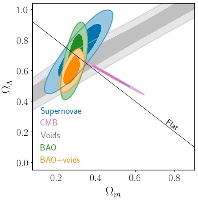

My research uses measurements of the large-scale distribution of matter and galaxies in the Universe to learn about dark energy and cosmology.
This work covers theory, simulation and observations of redshift-space distortions, baryon acoustic oscillations, gravitational lensing and secondary CMB anisotropies.
I am best known for my work developing the use of *cosmic voids* as a precision tool for such studies.  

I am a member of the Euclid, DESI, DES and eBOSS galaxy survey collaborations. In Euclid, I am co-lead of the Voids Work Package (WP:V) and validation lead for the galaxy sample selection (SEL-ID) and spectroscopic visibility mask (VMSP-ID) processing functions in the Science Ground Segment.

You can find my full publication list [here](publications.md). Or follow the links below to read more about some research highlights.

<section class="wrapper style3 align-center">										
	

		

			<section >		
			    <h3></h3>
				
Counting voids to probe Dark Energy 

			</section>					
            <section>
                <h3></h3>
                
Real space density profile reconstruction

            </section>
            <section>
                <h3></h3>
                
Multipole analysis of RSD around voids

            </section>								
            <section>
                <h3></h3>
                
Cosmology and Gravity from AP + RSD

            </section>            
            <section>
                <h3></h3>	
                
Mastering peculiar velocities

            </section>
            <section>
                <h3></h3>	
                
The Alcock-Paczy&nacute;ski test with DR10 voids

            </section>
            <section>
                <h3></h3>	
                
VIDE: A Voronoi-Watershed void finder

            </section>
            <section>
                <h3></h3>	
                
SDSS DR9 voids and the impact of mask 

            </section>
        

    

</section>